<!--more-->
## XF-11 Replica VTOL Design and Testing using Tilt Rotor and Thrust Vectoring
<small> In association with NEXA Flight, South Africa </small>

   <!-- Static Image -->
   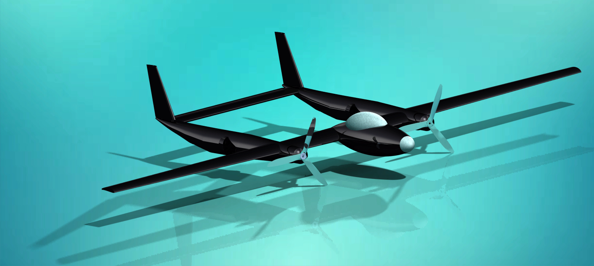

  <!-- Slider for multiple images -->
  

        

            

                 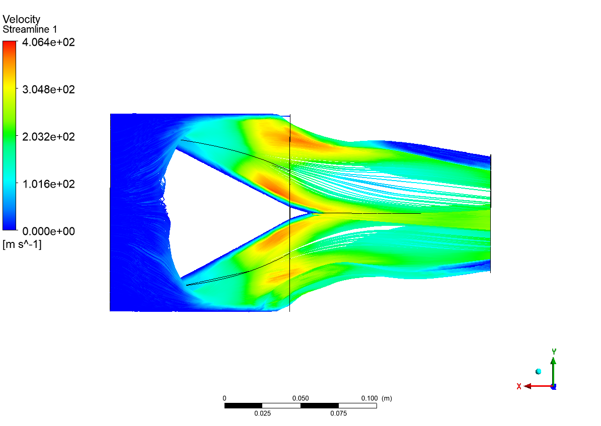
                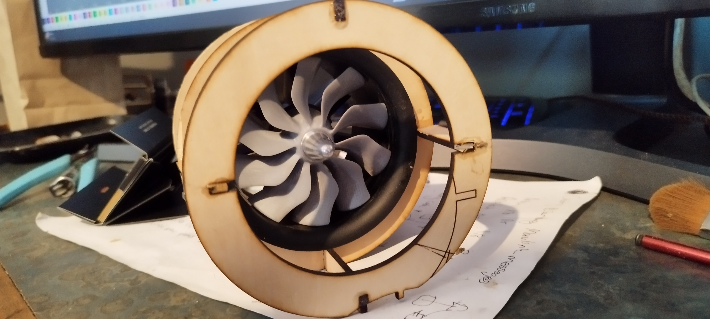
                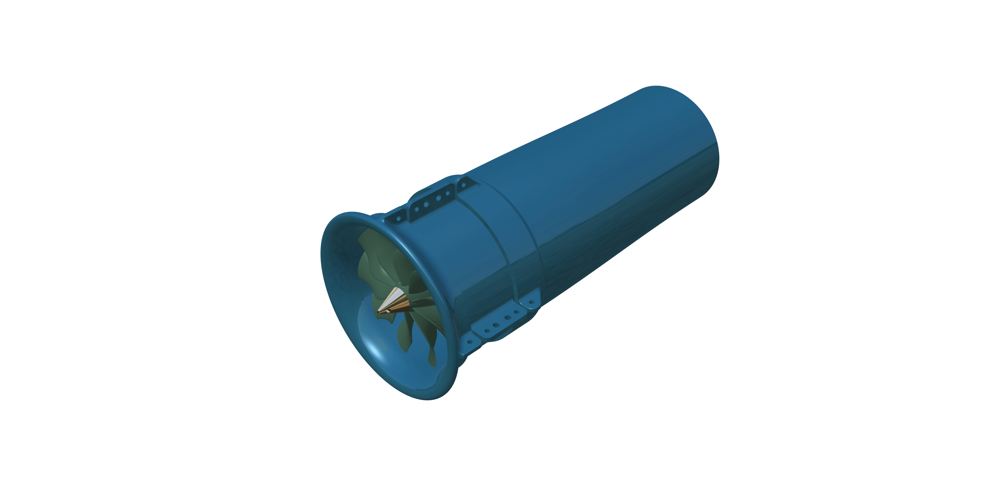
                
            

        

        <!-- Controls -->
        <button onclick="prevSlide()" \style="position: absolute; left: 10px; top: 50%; transform: translateY(-50%); z-index: 1;">◀</button>
        <button onclick="nextSlide()" \style="position: absolute; right: 30px; top: 50%; transform: translateY(-50%); z-index: 1;">▶</button>
    

- Led preliminary design and analysis for UAV with tilt-rotor mechanics and thrust vectoring to enable VTOL capabilities.
- Optimized inlet shape and draft tubes for boom-mounted ducted fans, minimizing aerodynamic losses.
- Managed manufacturing and structural design of components and molds.
- Assisted in mission planning and flight testing of the developed UAV system

## Design and Analysis of a Multi-Engine General Aviation Trainer Aircraft
<small> Senior Design Project, Supervised by Dr. Sudip Bhattrai </small>

    

- Designed a preliminary model of a multi-engine general aviation trainer aircraft capable of STOL operations.
- Conducted tests on the model to assess static and dynamic stability, handling qualities, and various maneuvers using a flight simulator.
- Studied the aerodynamic properties on a scaled-down 3D printed model in a low-subsonic wind tunnel.
- Presented the design and corresponding results in the Annual Aircraft Design Review hosted by the [Department of Mechanical and Aerospace Engineering, Pulchowk Campus.](https://mech.pcampus.edu.np/)

## Design and Fabrication of a Medical Delivery Drone
<small> for the AIAA Design, Build, and Fly (DBF) Competition-2022</small>

    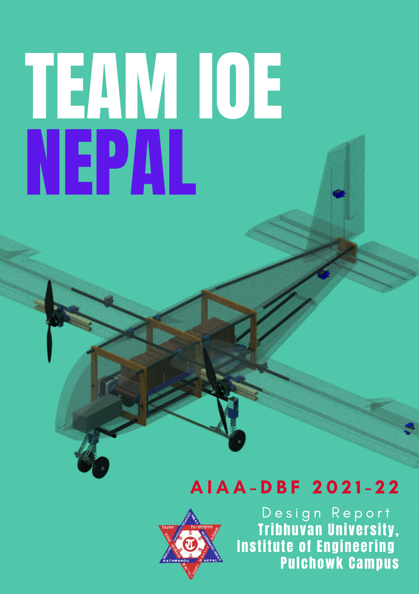
    

    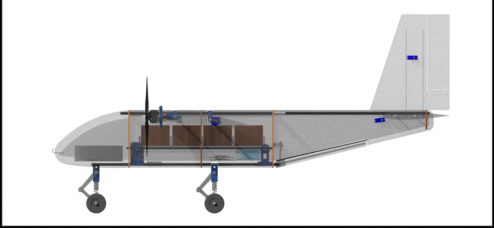

- Studied the effectiveness of UAVs’ usage in delivering medical and critical emergency supplies in rural areas.
- Led design and analysis team contributing directly to the conceptual and detailed design of the fixed-wing medical drone.
- Developed a conveyer-based payload drop-off mechanism capable of holding and unloading 4 medical payload pallets, weighing 8 ounces each, in a mission-specified pattern.
- Conducted structural analysis of the UAV components and performed experimental works for the ground and flight testing of the UAV.

## Design and Fabrication of a 4-axis Hotwire CNC Foam Cutter
<small> for the AIAA-DBF Club </small>

    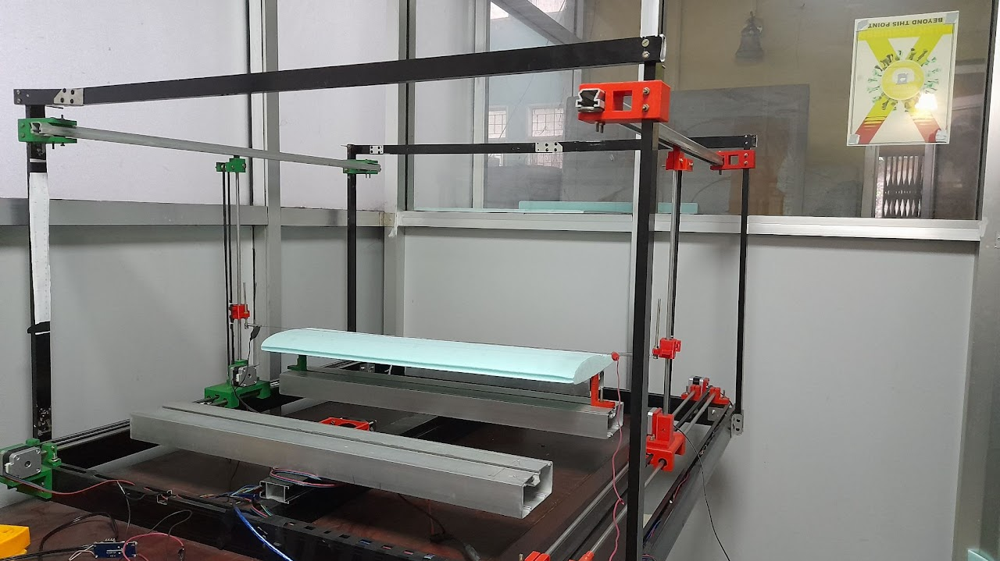

- Designed and fabricated a 4-axis Hotwire CNC Foam Cutter to shape styrofoam panels to the desired form for wings and empennage.
- Contributed to the controller design for the CNC using Arduino UNO and programmed the setup to run on user-defined G-codes using GRBL HotWire Mega 5x.

## Study of Aerodynamic Forces on a NACA 0012 Foil Using DAQ system in a Low Subsonic Wind Tunnel
<small> Academic Project, Supervised by Asst. Prof. Kamal Darlami </small>

    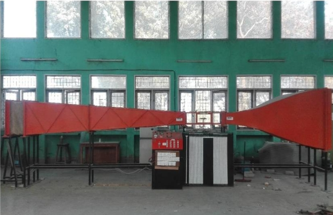
    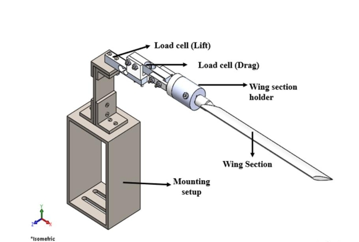
    

- Designed and fabricated a wing mounting system for the low subsonic open-circuit wind tunnel test section at IIEC (Incubation Innovation and Entrepreneurship Centre).
- Developed an instrumentation system for acquiring real-time lift and drag forces from the NACA 0012 wing
section using NI-SCB 68 DAQ system.
- Calibrated and validated the system by comparing the results from the wind tunnel experiment using a data acquisition system with corresponding numerical simulations.

## Design and Manufacture of a Can-Sat for a High Altitude Baloon
<small> Mechanical Design Lead| Initiated by [SEDS-Pulchowk](https://seds.pcampus.edu.np/) , in collaboration with [SEDS-Nepal](https://sedsnepal.org/)-High altitude balloon project </small>

    
    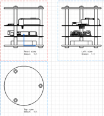

- Worked on the mechanical design team to design a Can-Sat for humidity sensing, to be launched through a high-altitude balloon.
- Contributed directly to design optimization and material selection and supervised the fabrication process of the satellite’s mechanical structure.

## Design and Fabrication of Twin-Boom Radio-Controlled (RC) UAV systems

    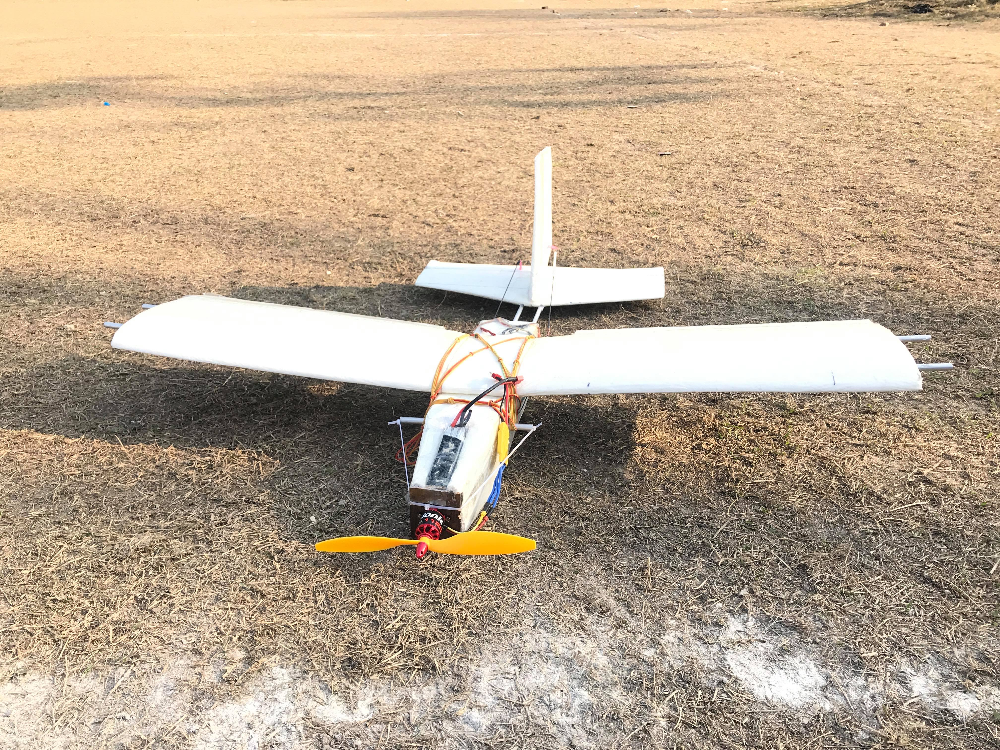
    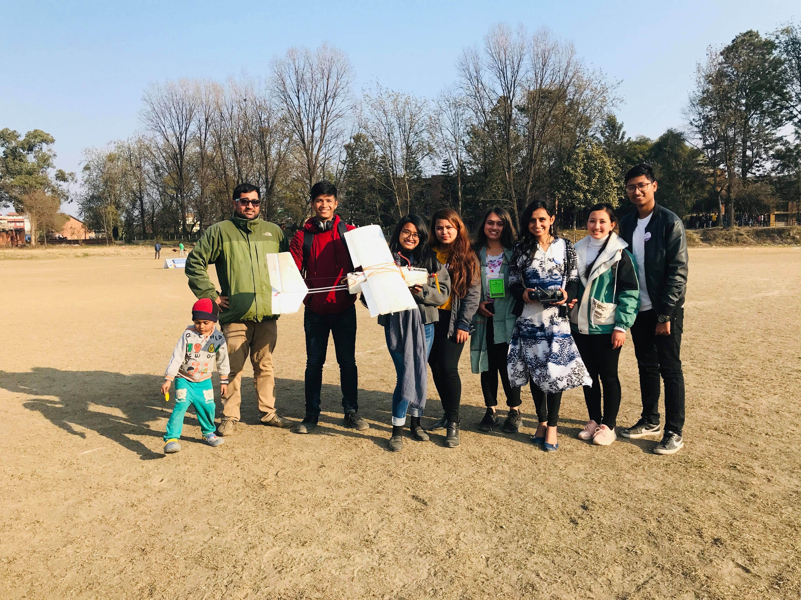

- Developed and constructed a twin-boom puller radio-controlled (RC) aircraft as part of the [Society of Mechanical and Aerospace Engineering’s (SOMAES)](https://somes.ioe.edu.np/) initiative.
- Demonstrated the aircraft during the airshow at the 11th National Mechanical and Aerospace Engineering Exhibition