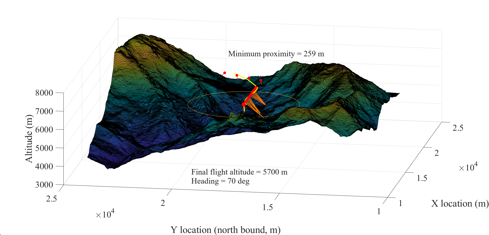
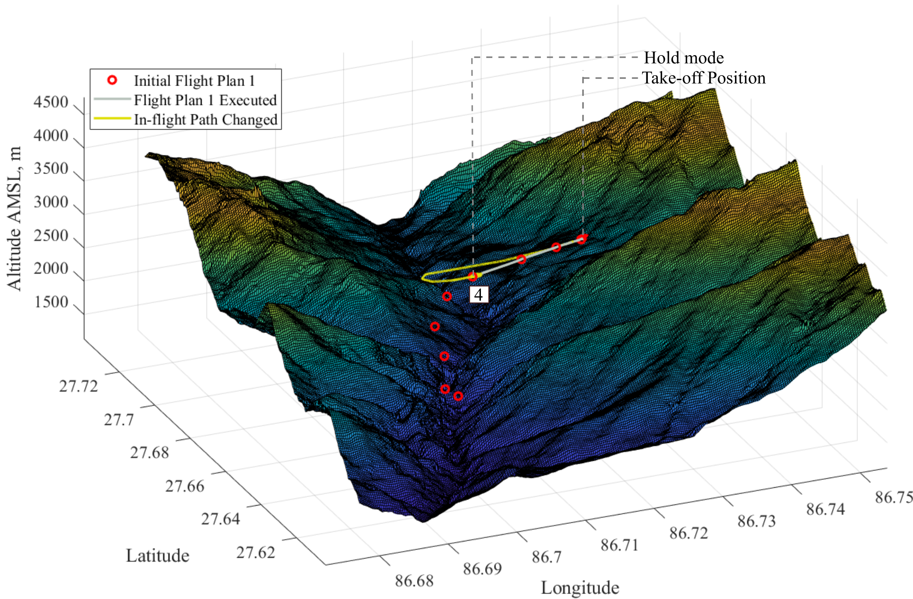
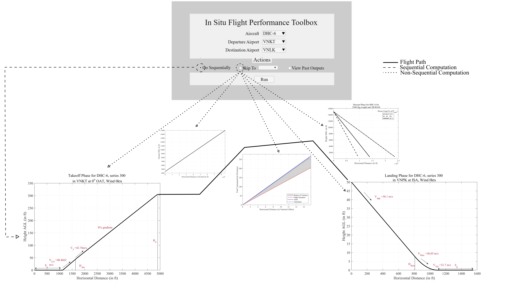
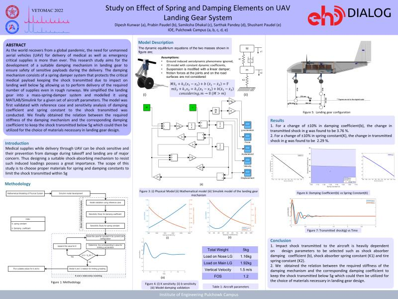
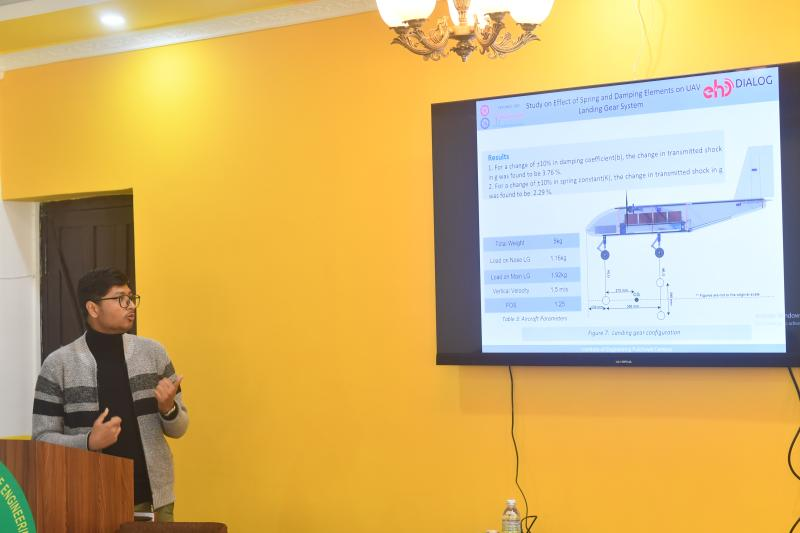
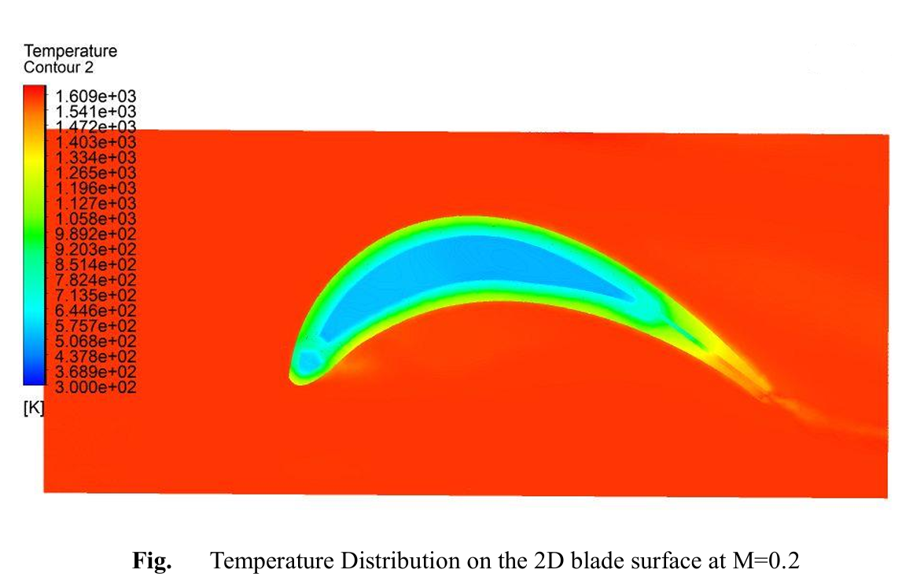
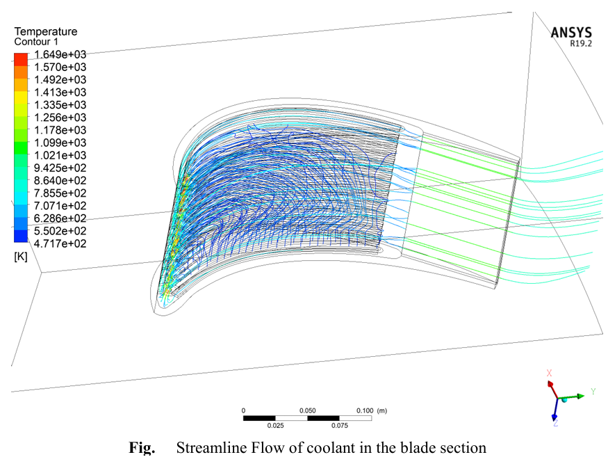

<!--more-->

## In situ Flight Data Analysis, Performance, and Planning for STOL Operations
<small>Supervised by Dr. Sudip Bhattrai</small>

    
    

- Designed an In Situ Flight Data Analysis (iFDA) toolbox for turboprop aircraft, offering real-time performance calculations and decision-making aids, validated within 3% accuracy against flight manuals and simulations.
- Integrated terrain proximity analysis and dynamic decision support to improve operational safety in complex, geographically constrained short takeoff and landing (STOL) environments.
- Demonstrated the toolbox’s capability in real-time path planning and Controlled Flight Into Terrain (CFIT) avoidance for challenging terrains, such as Nepal’s Annapurna region.

**Related Publications**:

[1] **D. Kunwar**, P. Bhandari, S. Shrestha, S. Bhattrai, V. Paudel and S. Neupane, “In situ Flight Data Analysis, Performance, and Planning for STOL Operations,” _AIAA Aviation Forum and ASCEND_, Jul. 2024.Available: https://doi.org/10.2514/6.2024-4253

## Formulation of Insitu Flight Performance Toolbox for Decision Support System
<small>Undergraduate Thesis, Supervised by Dr. Sudip Bhattrai and Er. Vishal Paudel</small>

    

- Developed a mathematical model to estimate operational requirements and performance calculations for various flight phases using MATLAB, particularly tailored to the DHC-6, series 300 aircraft.
- Validated and tested the model by cross-referencing it with performance charts and supplementary data obtained from Nepal Airlines Corporation.
- Incorporated decision support aids the model for the imposed airport, aircraft, and regulatory limitations.
- Designed an intuitive graphical interface integrating the outputs, decision aids, and flight profiles generated.

**Related Publications**:

[1] **D. Kunwar**, P. Bhandari,and S. Shrestha,“Formulation of Insitu Flight Performance Toolbox for Decision Support System," Thesis, _Tribhuvan University, Institute of Engineering, Pulchowk Campus_, 2023. Available: https://elibrary.tucl.edu.np/handle/20.500.14540/17733

## Study on Effects of Spring and Damping Elements on UAV Landing Gear System

    
    

- Aimed at development of a suitable damping mechanism in landing gear to ensure safety of sensitive payloads during the delivery using UAV,
- Formulated a Simulink-based model to study the effects of spring and damping elements in a simplified oleo strut landing gear system for Unmanned Aerial Systems (UAS).
- Utilized the model developed to choose suitable materials for spring and damper to limit the transmitted shock within 5g’s to ensure the safety of medical packages for a fixed-wing medical delivery drone.

**Related Publications**:

[1] **D. Kunwar**, P. Paudel, S. Dhakal, S. Pandey, and S. Paudel, “Study on Effect of Spring and Damping Elements on UAV Landing Gear System,” Poster, _International Conference on Vibration Engineering and Technology of Machinery (VETOMAC), Springer Nature,_ 2022

## Study of Temperature Distribution and Cooling Effectiveness for Combined Impingement-Convection Cooling (CICC) in Strut Insert Turbine Blade
<small> Academic Research, Supervised by Asst. Prof. Kamal Darlami </small>

    
    

- Investigated the cooling effectiveness of a turbine blade with Combined Impingement- Convection Cooling (CICC) design at different blowing ratios using Ansys Fluent.
-  Studied the temperature distribution and velocity profile over the blade surface to determine blade film cooling
performance

**Related Publications**:

[1] B. Parajuli, **D. Kunwar**,  P. Regmi, and S. Shrestha, _“Study of Temperature Distribution and Cooling Effectiveness for Combined Impingement-Convection Cooling (CICC) in Strut Insert Turbine Blade,” Preprint, 2021